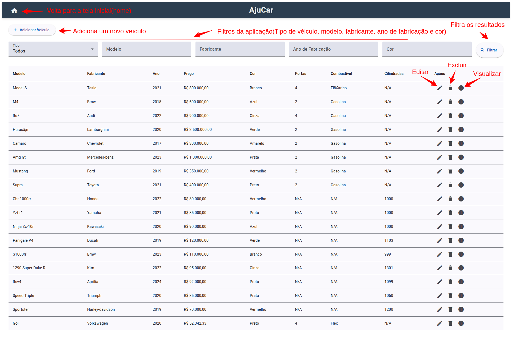

# Desafio Técnico - Desenvolvedor Java



## Objetivo

O objetivo deste desafio é desenvolver um sistema simples para gerenciar veículos de uma frota.

## Tecnologias utilizadas

- Java 17
- Spring Boot
- Spring Data JPA
- MySQL
- Maven
- Docker
- Angular
- Angular Material

## Configurando o ambiente local

Para configurar o ambiente localmente, é necessário ter o NPM instalado. Sugiro utilizar o [NVM](https://github.com/nvm-sh/nvm?tab=readme-ov-file#installing-and-updating).
Para instalar o NVM no **Linux**, basta seguir os seguintes passos:

```bash
curl -o- https://raw.githubusercontent.com/nvm-sh/nvm/v0.40.1/install.sh | bash

# ou

wget -qO- https://raw.githubusercontent.com/nvm-sh/nvm/v0.40.1/install.sh | bash
```

Em seguida, adicionar o seguinte trecho no arquivo `~/.bashrc` ou `~/.bash_profile` ou `~/.zshrc`:

```bash
export NVM_DIR="$([ -z "${XDG_CONFIG_HOME-}" ] && printf %s "${HOME}/.nvm" || printf %s "${XDG_CONFIG_HOME}/nvm")"
[ -s "$NVM_DIR/nvm.sh" ] && \. "$NVM_DIR/nvm.sh" # This loads nvm
```

Por fim, instalar o node usando o comando abaixo:

```bash
nvm install 20
```

Com isso, basta instalar o Angular CLI usando o comando abaixo:

```bash
npm install -g @angular/cli
```

Em seguida, basta executar o comando `npm install` no diretório `raiz` do projeto para instalar as dependências do projeto.

Para configurar o backend, [clique aqui](https://github.com/douglascunha1/ajucar)

## Executando o projeto

Para executar o projeto, basta executar o comando `ng serve` no diretório `raiz` do projeto. Em seguida, basta acessar o endereço `http://localhost:4200` no navegador.


